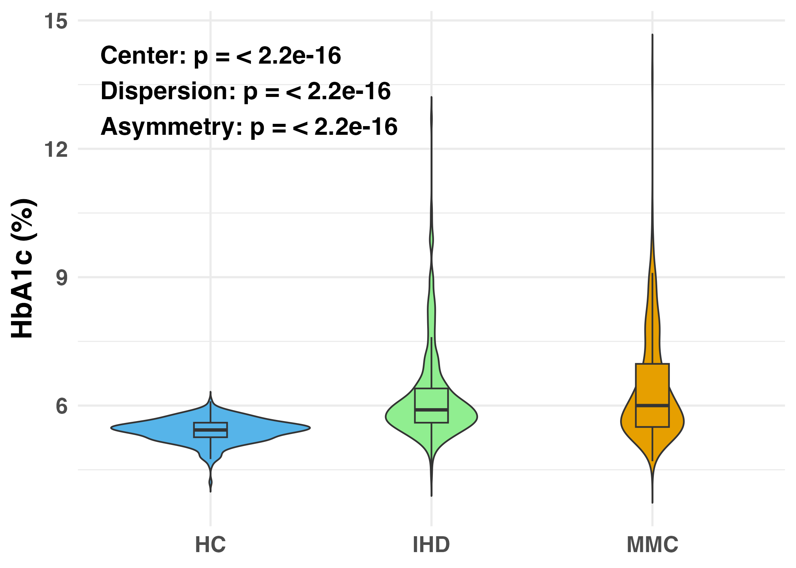
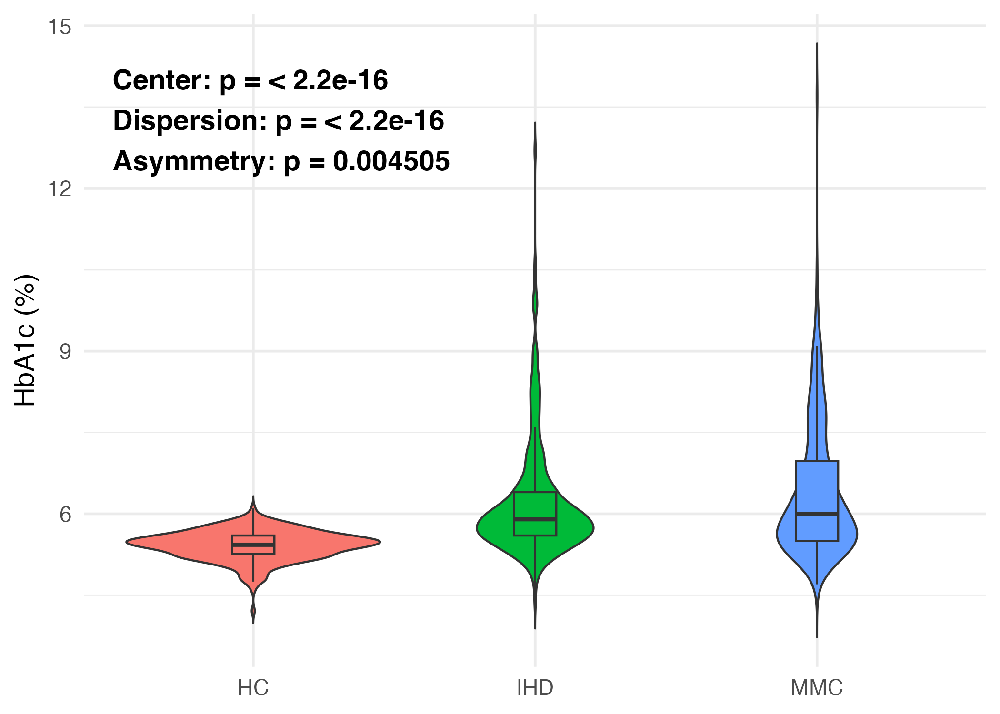

# DeSHAPE  
**Decomposing ecological Structure through Heterogeneity, Asymmetry and Pattern Evaluation of alpha-Diversity**

## Overview

**DeSHAPE** (*Decomposing ecological Structure through Heterogeneity, Asymmetry and Pattern Evaluation of alpha-Diversity*) is an R package that provides a diagnostic framework for testing **distributional shifts** in alpha diversity across biological groups. It focuses on detecting shifts in:

- **Center** (e.g., median)
- **Dispersion** (spread and variability)
- **Asymmetry** (skewness)

DeSHAPE supports both **permutation-based** and **quantile-regression-based** testing strategies, with or without covariate adjustment.

---

## Installation

Install the development version directly from GitHub:
```r
# install.packages("devtools")
library(devtools)
devtools::install_github("bioscinema/DeSHAPE")
library(DeSHAPE)
```

## Functions

| Function                  | Description                                               | Best Used When                                                             |
|---------------------------|-----------------------------------------------------------|----------------------------------------------------------------------------|
| `deshape_perm_pair()`     | Permutation test for **2 groups**                         | Exploratory tests (center, dispersion, asymmetry) for two groups                                 |
| `deshape_perm_multi()`    | Permutation test for **>2 groups**                        | Exploratory tests (center, dispersion, asymmetry) for multiple groups                                                |
| `deshape_wald_contrast()` | Quantile-regression-based **contrast test**               | Covariate-adjusted tests for center, dispersion, or asymmetry (sample size of each group > 30)                            |
| `deshape_glm_resid_test()`| Residual-shape permutation test **after** a GLM fit       | Covariate-adjusted tests for center, dispersion, or asymmetry   |
| `stat_deshape_compare()` | Add a single label to a ggplot panel showing three p-values (center, dispersion, asymmetry). | Quick visual reporting on plots; supports unadjusted permutation tests or covariate-adjusted QR/Wald contrasts. |


## 1. Permutation-Based Testing

### 1.1 `deshape_perm_pair()`

Permutation-based comparison for **two groups** (e.g., group A vs group B).

```r
deshape_perm_pair(response ~ group,
               data        = df,
               mode        = "center",     # or "dispersion", "skewness"
               alternative = "two.sided",  
               perm        = 999,
               seed        = 2025)
```

- `"center"`: Median difference permutation test  
- `"dispersion"`: Interquartile range (IQR) permutation test
- `"skewness"`: Quantile-based asymmetry score permutation test

---

### 1.2 `deshape_perm_multi()`

Permutation-based comparison for **three or more groups** (center, dispersion, or skewness).

```r
deshape_perm_multi(response ~ group,
                data = df,
                mode = "center",   # or "dispersion", "skewness"
                perm = 999,
                seed = 2025)
```

- `"center"`: Tests for median shift using permutation test on ANOVA-style test statistic  
- `"dispersion"`: Tests for IQR shift using permutation test on ANOVA-style test statistic  
- `"skewness"`: Tests for asymmetry score shift using permutation test on ANOVA-style test statistic  

---

## 2. Quantile Regression Contrast Test

### 2.1 `deshape_wald_contrast()`

`deshape_wald_contrast()` performs a Wald-type test on linear contrasts of quantile-regression coefficients across multiple quantile levels. It supports both **pre-specified contrasts** (`mode = "customize"`) and **automatic contrasts** for testing **dispersion** or **symmetry**.

The function fits quantile regressions at each specified quantile (`taus`) using `quantreg::rq`, stacks the coefficients, and builds an asymptotic covariance matrix from kernel density estimates of residuals. A Wald χ² statistic (1 d.f.) is computed, and p-values are returned.

```r
deshape_wald_contrast(
  formula, data,
  mode = c("customize", "dispersion", "symmetry"),
  taus = NULL,
  contrast = NULL,
  alternative = c("two.sided", "greater", "less"),
  kernel = "gaussian"
)
```

#### Arguments
- **formula**: model formula, e.g. `response ~ predictors`.  
  - For non-custom modes, the **first non-intercept term** must be a **binary group variable** producing exactly one column in `model.matrix`.  
- **data**: data frame with variables in `formula`.  
- **mode**: contrast construction mode.  
  - `"dispersion"`: compares group effects between two quantiles (default `taus = c(0.25, 0.75)`).  
  - `"symmetry"`: compares group effects across three quantiles with weights +1, –2, +1 (default `taus = c(0.1, 0.5, 0.9)`).  
  - `"customize"`: user supplies both `taus` and `contrast`.  
- **taus**: numeric vector of quantile levels (ascending).  
  - Required for `"customize"`.  
  - Must be length 2 for `"dispersion"`, 3 for `"symmetry"`.  
- **contrast**: numeric vector (or single-column matrix) of length `p × K`, where `p = ncol(model.matrix(...))` and `K = length(taus)`. Used only when `mode = "customize"`.  
- **alternative**: `"two.sided"` (default), `"greater"`, or `"less"`.  
- **kernel**: currently only `"gaussian"` is supported.  

#### Value
Returns a list with:  
- `test_stat`: Wald χ² statistic (1 d.f.)  
- `p_value`: p-value under the specified alternative  

---

### 2.2 Coefficient stacking and contrast construction

At each quantile τ, the regression has `p` coefficients. These are **stacked by quantile** into a vector of length `p × K`:

```
[Int τ1, group τ1, cov1 τ1, cov2 τ1, ...,
 Int τ2, group τ2, cov1 τ2, cov2 τ2, ...,
 ...
 Int τK, group τK, cov1 τK, cov2 τK, ...]
```

A **contrast vector** selects and compares coefficients across quantiles:  
- **Dispersion (auto):** with `taus = (τL, τU)`, places –1 on the group at τL and +1 at τU.  
- **Symmetry (auto):** with `taus = (τL, τM, τU)`, places +1, –2, +1 on the group at τL, τM, τU.  
- **Customize:** user-defined, any valid contrast of length `p × K`.  

---

### 2.3 Examples

**A. Dispersion test (automatic)**  
Tests whether the group effect increases from τ = 0.25 to τ = 0.75.

```r
deshape_wald_contrast(
  Shannon ~ group + Depth,
  data = df,
  mode = "dispersion"
)
```

**B. Symmetry test (automatic)**  
Tests whether the group effect is symmetric across τ = 0.1, 0.5, 0.9.

```r
deshape_wald_contrast(
  Shannon ~ group + Depth,
  data = df,
  mode = "symmetry"
)
```

**C. Custom contrast**  
Explicitly test whether `β_group(0.75) – β_group(0.25) = 0`.  
Here, `p = 3` (Intercept, group, Depth), `K = 2` (`taus = c(0.25, 0.75)`), so `length(contrast) = 6`.

```r
taus <- c(0.25, 0.75)
contrast <- c(0, -1, 0, 0, +1, 0)

deshape_wald_contrast(
  Shannon ~ group + Depth,
  data = df,
  mode = "customize",
  taus = taus,
  contrast = contrast,
  alternative = "greater"
)
```

---

### 2.4 Practical notes
- For median-only differences, fitting a single quantile regression at τ = 0.5 and calling `summary()` may be quicker.  
- If the group variable is not binary or expands to multiple columns, use `mode = "customize"`.  
- Ensure `taus` are strictly ascending.  

## 3. GLM Residual Shape Test

### 3.1 `deshape_glm_resid_test()`

Compares the **center**, **dispersion**, or **skewness** of GLM residuals
across user-defined groups while automatically adjusting for all other
covariates in the model.

```r
# adjust for Depth, Cohort, then compare residual dispersion by group_prefix
deshape_glm_resid_test(Shannon ~ group_prefix + Cohort + Depth,
                  data = plot_df,
                  mode = "center",
                  family = Gamma(link = "log"), 
                  group = "group_prefix", 
                  alternative = "greater",
                  q = 0.25, 
                  B = 999, 
                  seed = 2025)
```

Internally the function drops `group` from the right-hand side before
fitting the GLM, so residuals are free of the group effect yet still
reflect all other covariate adjustments.

**Choosing `q`**

- **`mode = "center"`** – `q` is ignored; you may supply any value.
- **`mode = "dispersion"`** – set **`q = 0.25`** to compute the classical inter-quartile range `Q(0.75) - Q(0.25)`.
- **`mode = "skewness"`** – `q` controls the tail width in the asymmetry score:  
  - **`q = 0.25`** → `Q(0.75) - 2 × Q(0.5) + Q(0.25)`  
  - **`q = 0.10`** → `Q(0.90) - 2 × Q(0.5) + Q(0.10)`

## 4. Plot Annotation with `stat_deshape_compare()`

`stat_deshape_compare()` adds a compact, three-line label to your ggplot showing p-values for **Center**, **Dispersion**, and **Asymmetry**.

- **Unadjusted mode** (no confounders): runs `deshape_perm_pair()` / `deshape_perm_multi()` internally.
- **Adjusted mode** (with confounders): 
  - Center via median (τ = 0.5) quantile-regression test,
  - Dispersion & Asymmetry via `deshape_wald_contrast()` with `mode = "dispersion"` / `"symmetry"`.

**Aesthetics required:** `x` (group), `y` (response).  
**Common args:** `confounder`, `confounder_data`, `label.x/label.y` (absolute), or `label.x.npc/label.y.npc` (`"left"|"right"|"center"` or numeric in `[0,1]`), `label.prefix`, `label.sep`, `perm`, `seed`, `alternative`.

### Example (Cardiometabolic / MetaCardis dataset; HC, MMC, IHD)

```r
ggplot(plot_df, aes(x = Status, y = HbA1c...., fill = Status)) +
  geom_violin(trim = FALSE) +
  geom_boxplot(width = 0.15, outlier.shape = NA) +
  stat_deshape_compare(
    label.y  = max(plot_df$HbA1c....) * 0.9,
    label.x  = 0.5,           # center horizontally
    size     = 5.5,
    fontface = "bold"
  ) +
  scale_fill_manual(values = c(
    "HC"  = "#56B4E9",
    "MMC" = "#E69F00",
    "IHD" = "lightgreen"
  )) +
  theme_minimal(base_size = 14) +
  labs(x = NULL, y = "HbA1c (%)") +   # set to the actual measure shown
  theme(
    legend.position = "none",
    axis.title.y    = element_text(face = "bold", size = 18),
    axis.text       = element_text(face = "bold", size = 14),
    plot.title      = element_blank()
  )
```


Figure:


#### Adjusted example (with confounders)

```r
ggplot(plot_df, aes(x = Status, y = HbA1c...., fill = Status)) +
  geom_violin(trim = FALSE) +
  geom_boxplot(width = 0.15, outlier.shape = NA) +
  stat_deshape_compare(
    confounder      = c("Gender","Depth"),
    confounder_data = plot_df,        # must contain these columns
    label.y  = max(plot_df$HbA1c....) * 0.9,
    label.x  = 0.5,
    size            = 5,
    fontface        = "bold",
    alternative     = "two.sided"
  ) +
  theme_minimal(base_size = 14) +
  labs(x = NULL, y = "HbA1c (%)") +
  theme(legend.position = "none")
```
Figure:


---

## Workflow Summary

1. Use `deshape_perm_pair()` or `deshape_perm_multi()` for unadjusted, distribution-based testing.
2. Use `deshape_wald_contrast()` when you want formal quantile-regression
   contrasts (especially for dispersion or tail asymmetry) **and** need
   covariate adjustment; for a simple median shift a single τ = 0.5
   quantile regression followed by `summary()` is usually quicker. Build your `contrast` vector carefully by indexing the relevant coefficient positions across quantile blocks.
3. Use `deshape_glm_resid_test()` when you have limited sample size or want it as sensitivity/robustness check to Wald contrast method.

---
